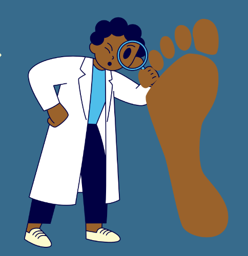
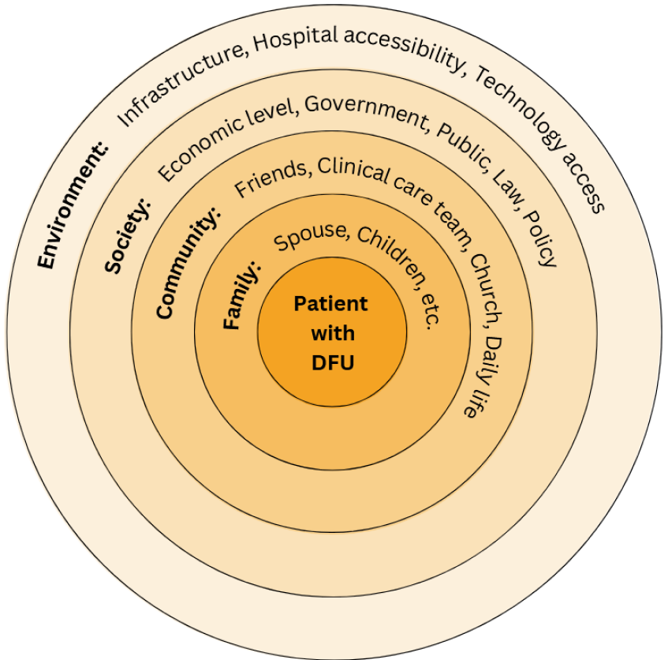

<h1 style="text-align: center; color:black;"> Selected Projects </h1>

  

  
  

  

  
 <b>“We Have to Be Advocates for Ourselves”: A Social-Ecological Approach to Mobile Health Design with Black Older Adults Living with Diabetes.</b>   <a href= "https://doi.org/10.1145/3706598.3713617"><em>CHI 2025</em> </a>    Even well-intentioned researchers may engage in health equity tourism. We explore mobile health design for Black older adults with low income, based on a two-year partnership with community sites and semi-structured interviews. W provide actionable recommendations for HCI researchers to mitigate health equity tourism, and reframe our findings through a social-ecological perspective to generate design insights  to better serve under-resourced communities.  
  
  

<!-- 

  
  
 <b>Clinical Standards & Proximate Futures: Participatory Design Futuring of Diabetes Technologies with an Under-resourced Community.</b>  <em>Forthcoming in IMWUT</em>    Imagined visions of the future underlie much of the history of ubiquitous computing. Critiques of speculative design approaches, however, amplify concerns of ubicomp’s inherent focus on the future, inciting questions of who is futuring and how to amplify historically marginalized voices. Taking a research through design approach, we conducted participatory speculative design workshops focusing on diabetes self-monitoring technology, within under-community sites which predominantly serve Black older adults. We explore community member perspectives on three modalities of ubiquitous health technologies: smarthome, wearable, and smartphone application. While much previous research focuses on diabetes technologies, we explore an area which is currently understudied by the ubicomp community: diabetic foot disease monitoring. Further, we center a community which faces greater diabetes health disparities. We provide findings related to health priorities and values of community members, and their broader considerations regarding current and speculative (AI-based) technologies. We reflect on the tensions between current clinical standards of care and the participant agency afforded by participatory design. Finally, we discuss the ways in which participants' views of current and speculative technologies contrast with ubicomp's as a field, specifically surrounding temporality and sociohistorical context.  
  

 -->

  

  
    

    

    
 <b>“Poker with Play Money”: Exploring Psychotherapist Training with Virtual Patients.</b>   <a href= "https://dl.acm.org/doi/10.1145/3757450"><em> PACM/CSCW 2025</em> </a>    Psychotherapists-in-training extensively engage in role-play exercises to practice interpersonal and therapeutic skills. We provide a case study of a realistic "virtual patient" system, evaluated by trained psychotherapists in comparison to their previous experiences with both real role-play partners and real patients. Our findings explore key interpersonal skills of psychotherapy, the utility of virtual patients compared to traditional role-play techniques, and factors which impacted psychotherapist-perceived "humanness" of the virtual patient.  

    

  

  
  

  

  
 <b>Equitable Diabetic Foot Ulcer Recognition Modeling </b>  <em>Forthcoming in IEEE EMBS BHI 2025</em> and <a href= "https://diabetesjournals.org/diabetes/article/74/Supplement_1/259-OR/159965"><em>ADA 85th Scientific Sessions</em></a>    Diabetic foot ulcers take a disproportionate toll on communities of color; however, these communities are currently underrepresented in image datasets. In support of more equitable and generalizable computational modeling, we detail our two-year effort to create the first repository of diabetic foot ulcer images collected predominantly from patients of color in naturalistic settings. Using our dataset, we evaluate state-of-the-art foot ulcer recognition models and provide evidence that they provide insufficient performance. We release our image dataset to support the development of larger, more diverse datasets, and ultimately more equitable models for diabetic foot care. 
  
  

<!-- 

<h2 style="text-align: center; color:black;">Current Research</h2>

  

    
Equitable Technology for Diabetes Management

    
    <ul>
        <li>Addressing Disparities via the Diabetic Ulcer Computational Sensing System, ADA Sponsored Research</li>
        <li>Designing Diabetes Mobile Health Technology for and with Community Members in Low-resource Settings, GCDTR Sponsored Research</li>
    </ul>
  

  

    
AI Virtual Patients for Clinician Upskilling

    
        <ul>
        <li>Exploring virtual patients for psychotherapist training, NSF Sponsored Research</li>
    </ul>
  

 -->

